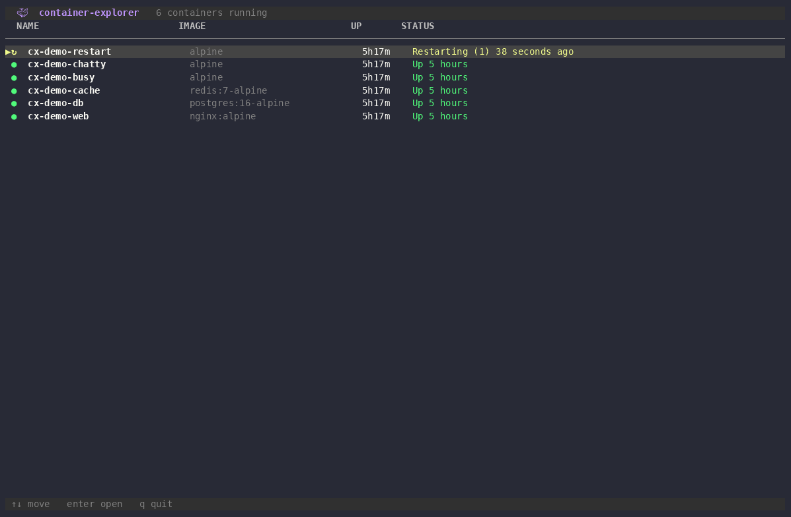

# `container-explorer`

> **`docker ps` that you can actually walk around in.** Every running container on the host as a live table — arrow into any one and get a full, self-refreshing inspect: CPU/mem/net sparklines, networks, mounts, ports, the processes really running inside it, and a live log tail. Built as a **yeet** reactive JSX TUI.

<p align="center">
  
  
  
  <a href="https://discord.gg/dYZu9PjKB"></a>
</p>



**`container-explorer` turns the host's running containers into a two-level, live-updating TUI: a table of everything running up top, and a full drill-down — stats, networking, mounts, ports, in-container processes, and a streaming log tail — one keypress away.**

Where `docker ps` gives you a frozen snapshot and `docker inspect` gives you a wall of JSON, `container-explorer` gives you both at once, live: the list refreshes on its own, and the detail view keeps polling only the container you're looking at.

> [!TIP]
> **You can't get this from `docker ps` + `docker stats` + `docker logs` in three panes.** Those are three separate streams you have to correlate by hand. `container-explorer` reads the daemon's own process/system graph, so the summary table, the per-container stats sparklines, the in-container process list (matched by cgroup, not guesswork), and the log tail are all the *same* live model — and the heavy `inspect`+`stats` poll only runs for the one container currently on screen.

## Quick start

```sh
curl -fsSL https://yeet.cx | sh
yeet run github:yeet-src/container-explorer
```
[Manual install guide](https://yeet.cx/docs/manual-installation) | Linux only

With Docker reachable by the yeet daemon, that's it — `container-explorer` queries `docker.list_containers`, paints the table, and starts refreshing. There are no flags to learn; it's a keyboard- and mouse-driven TUI:

| key                              | list          | detail                     |
| -------------------------------- | ------------- | -------------------------- |
| `↑` / `k`, `↓` / `j`             | move cursor   | scroll                     |
| `pgup` / `pgdn`, `home` / `end`  | jump          | scroll / top / bottom      |
| `enter` / `→` / `l`              | open detail   | —                          |
| `1`–`7`                          | —             | zoom a pane fullscreen     |
| `0`                              | —             | unzoom                     |
| `/`                              | —             | filter processes + logs    |
| `c`                              | —             | clear filter               |
| `esc` / `backspace` / `←` / `h`  | —             | back (or unzoom / unfilter)|
| `q`                              | quit          | quit                       |
| mouse click                      | select / open | click a pane to zoom       |
| wheel                            | —             | scroll                     |

## A 60-second primer on the per-drill-down poll

The hard part of a live inspector isn't fetching data — it's *not* fetching the data you aren't looking at. A full `inspect`+`stats`+`logs` poll for every container on the box, every second, would hammer the daemon for panes nobody has open. `container-explorer` scopes the work to the current view instead, and the whole thing falls out of one yeet idiom: `from()`.

**The list is one cheap poll.** `containers` is a single `from()` signal that runs `docker.list_containers` every 2 s while anything is watching it — which, in the list view, is the table. It carries only what a row needs: name, image, state, uptime, status.

**The detail poll is born per drill-in.** When you open a container, `detailFor(name)` mints a *fresh* `from()` signal that polls `docker.inspect_container(name)` (plus stats and the process/cgroup join) every 1.5 s. Because a `from()` producer starts when first watched and its cleanup runs when the last watcher goes away, mounting the detail panel *is* what starts that poll, and hitting `esc` to go back is what stops it. No manual start/stop, no leaked timers.

**Logs are a subscription, not a poll.** The log pane opens a `docker_logs` GraphQL subscription that follows the container's stdout/stderr live, buffered into a bounded ring and rendered on a timer — so a chatty container can't cause one re-render per line.

The net effect: idle containers cost one lightweight list query, and the expensive per-container machinery exists only for as long as its panel is on screen.

## Common use cases

`container-explorer` is for anyone who lives in `docker ps` / `docker inspect` / `docker stats` and is tired of stitching them together by hand.

- Something's eating CPU or memory — open it and watch the live sparklines instead of re-running `docker stats`.
- "What's *actually* running inside this container?" — the processes pane joins host processes to the container by cgroup, so you see the real PIDs, RSS, and command lines, filterable with `/`.
- Debugging a crash loop — the state, restart count, exit code, and a live log tail are all one screen.
- Auditing networking — per-network IPv4/gateway/MAC, published port bindings, and live per-interface rx/tx, without three `inspect` invocations.

## What you're looking at

The **list** view is one row per container — a state glyph, name, image, uptime, and a live status line:

```
container-explorer   7 containers running
  NAME                          IMAGE                          UP        STATUS
▶ ● web                         nginx:alpine                   3h12m     Up 3 hours
  ● api                         ghcr.io/acme/api:latest        3h12m     Up 3 hours (healthy)
  ● postgres                    postgres:16                    3h12m     Up 3 hours
  ○ migrate                     ghcr.io/acme/api:latest        3h11m     Exited (0) 3 hours ago
```

The glyph and its color encode state at a glance (green `●` running, grey `○` exited, red `✗` dead, …). `enter` on the selected row drills in.

The **detail** view is a scrolling stack of panes for the one selected container:

| pane         | what it shows                                                                    |
| ------------ | -------------------------------------------------------------------------------- |
| `overview`   | live CPU / mem / rx / tx sparklines, memory + PID counters                       |
| `networking` | each attached network's IPv4 / gateway / MAC, published port bindings, live rx/tx |
| `volumes`    | every mount (volume + bind) with rw/ro and propagation                           |
| `ports`      | exposed / published ports                                                        |
| `processes`  | host processes joined to the container by cgroup — PID, state, RSS, comm, cmdline |
| `logs`       | a live-following stdout/stderr tail                                              |
| `command`    | the container's entrypoint + args                                                |

Any pane zooms to fullscreen — press its number (`1`–`7`) or click it — and `/` filters the `processes` and `logs` panes by substring.

## How it works

The whole thing is a pure-JS yeet script — no BPF. It reads the daemon's process/system graph over GraphQL and renders it with yeet's reactive JSX TUI (signals, not a vdom: a node re-renders exactly when a signal it read changes).

### The data side

Two queries and one subscription, all against the daemon graph:

| source | query | feeds |
|---|---|---|
| list      | `docker.list_containers`                       | the summary table, refreshed every 2 s |
| detail    | `docker.inspect_container(name)` + `procs`     | the per-container panes, every 1.5 s while open |
| logs      | `docker_logs(...)` subscription                | the live log tail |

The `processes` pane is a join done in JS: the detail query pulls host `procs` with their `cgroups`, and each process whose cgroup path contains the container id is attributed to that container — so you see the real in-container PIDs without a shell into it.

### The JS side

| file | responsibility |
|---|---|
| `src/main.jsx`               | routing (`list` ↔ `detail`), all key/mouse handling, the UI state signals |
| `src/probes/containers.js`   | the `containers` list signal + the `detailFor(name)` / `logsFor(name)` factories |
| `src/components/list.jsx`    | the top-level table |
| `src/components/detail.jsx`  | the per-container drill-down and its pane layout / hit-testing |
| `src/components/chrome.jsx`  | title bar + footer |
| `src/lib/format.js`          | byte / age / percent formatting, state colors + glyphs, sparklines |

Two patterns worth calling out:

- **View-scoped polling.** The `view` signal decides which subtree is mounted, and mounting/unmounting the detail subtree is exactly what starts/stops the per-container poll — see the primer above.
- **Padded fixed-width cells.** Every table cell is a `<Text width="N">{pad(value, N)}</Text>`. Yoga (in a `direction="row"` container) shrinks fixed-width children toward their content unless you pad them, which is what the `pad()` helper in `lib/format.js` exists for.

## Requirements

> [!IMPORTANT]
> **Docker reachable by the yeet daemon** — `container-explorer` reads the daemon's Docker graph, so `yeetd` needs access to the Docker socket. No BPF, no BTF, no special kernel features are required; it's a pure-JS script.
>
> The yeet daemon itself handles the privileged graph access. `curl -fsSL https://yeet.cx | sh` installs it.

## Honest caveats

> [!NOTE]
> container-explorer is a read-only viewer. It shows you what's running; it does not start, stop, or reconfigure anything.

- It's an inspector, not a controller — there are no start/stop/restart/exec actions today. ([contact us](https://yeet.cx/?utm_source=github&utm_medium=readme&utm_campaign=container-explorer&utm_content=caveats-control) for custom yeet scripts that act on containers)
- The `processes` pane attributes host processes to a container by matching cgroup paths against the container id; unusual cgroup layouts (e.g. some rootless or nested setups) may under- or over-match.
- CPU/mem/net figures come from the Docker stats stream, sampled between polls — they're the same numbers `docker stats` reports, with the same sampling granularity.

## Community questions

**Why not just use `docker ps` / `docker stats` / `docker inspect`?**
Those are three separate, snapshot-or-stream commands you correlate by hand. `container-explorer` fuses them into one live model with a table you can navigate and a drill-down that refreshes itself — and it only does the expensive per-container work for the container you're looking at.

**Does it slow the daemon down?**
The list is one lightweight query every 2 s. The heavy `inspect`+`stats` poll and the log subscription exist only while a detail panel is open, and tear down the moment you go back — so idle containers cost almost nothing.

**How does the processes pane know what's in a container?**
It joins host processes to the container by cgroup: the detail query pulls each process's cgroup paths, and anything whose path carries the container id is attributed to it. No shell-in required.

**Does it work with anything other than Docker?**
Today it reads the daemon's Docker graph specifically. Other runtimes would need the corresponding graph source — [contact us](https://yeet.cx/?utm_source=github&utm_medium=readme&utm_campaign=container-explorer&utm_content=faq-runtime) if that's you.

**Can I export what it shows?**
Not built in — it's a live TUI. The underlying `yeet.graph` queries in `src/probes/containers.js` are where you'd tap the same data for a structured export (JSON, a metrics sink, etc.). [Contact us](https://yeet.cx/?utm_source=github&utm_medium=readme&utm_campaign=container-explorer&utm_content=faq-export) to set up a managed pipeline.

## Building from source

```sh
make          # bundles src/main.jsx → src/index.jsx via the vendored esbuild
yeet run .    # runs the TUI locally (Docker must be reachable by yeetd)
```

`yeet run` invokes `make` automatically when running from a trusted remote source, so the default goal always leaves the project runnable. The bundle is written to `src/index.jsx`, which the entry ladder prefers over `src/main.jsx` — so once built, that is what runs. The build needs no npm/node: esbuild resolves the `@/` alias and leaves `yeet:*` builtins external.

## License

GPL-2.0.

---

Built with [yeet](https://yeet.cx/docs/?utm_source=github&utm_medium=readme&utm_campaign=container-explorer), a JS runtime for writing eBPF programs and system tools on Linux machines. Join us on [discord](https://discord.gg/dYZu9PjKB?utm_source=github&utm_medium=readme&utm_campaign=container-explorer).
